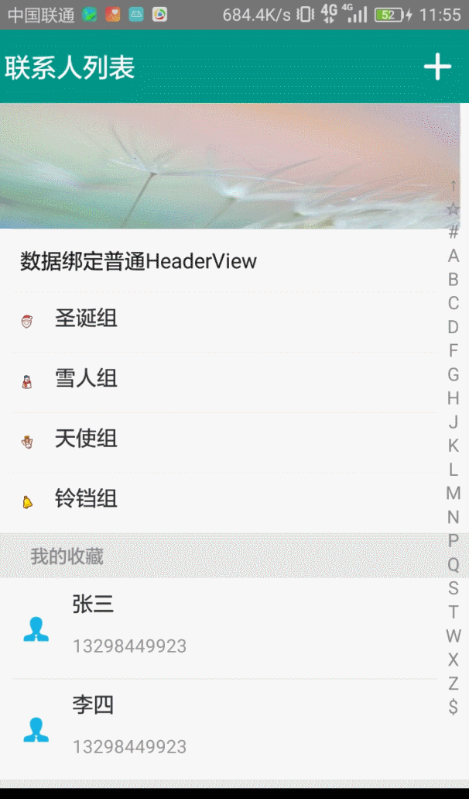

# IndexStickyView
1. 列表索引
2. 滑动过程中顶部Title固定
3. 支持自定义Bar的颜色样式
4. 支持添加自定义`Header`或`Footer`不同类型的`View`
5. 支持`ItemClick`和`ItemLongClick`事件

# Demo
典型示例为联系人列表和城市列表展示


# 使用
### gradle
在项目的`build.gradle`文件中添加如下依赖
`compile 'cn.ittiger:indexstickyview:1.0.0'`

### xml布局
```xml
<cn.ittiger.indexlist.IndexStickyView
    xmlns:app="http://schemas.android.com/apk/res-auto"
    android:id="@+id/indexStickyView"
    android:layout_width="match_parent"
    android:layout_height="match_parent"
    app:sideBarBackgroundColor="@android:color/white"   //SideBar的背景色
    app:sideBarFocusBackgroundColor="@android:color/holo_red_dark"   //SideBar处于选中状态的背景色
    app:sideBarFocusTextColor="@android:color/white"  //SideBar处于选中状态时的文字颜色
    app:sideBarTextColor="@android:color/black"  //SideBar显示文字的颜色
    app:sideBarTextSize="18sp"  //SideBar文字大小
    app:sideBarTextSpace="4dp"  //SideBar文字之间的间距
    app:sideBarWidth="24dp">  //SideBar的宽度
```

### 集成
1. 数据实体类实现接口`BaseEntity`
	```java
	public class CityEntity implements BaseEntity {
    private String mCityName;

    public CityEntity(String cityName) {

        mCityName = cityName;
    }

    @Override
    public String getIndexField() {

        return mCityName;
    }

    public String getCityName() {

        return mCityName;
    }
	```
2. 继承`IndexStickyViewAdapter`
	```java
	private class CityAdapter extends IndexStickyViewAdapter<CityEntity> {

        public CityAdapter(List<CityEntity> originalList) {

            super(originalList);//要展示的数据
        }

        @Override
        public RecyclerView.ViewHolder onCreateIndexViewHolder(ViewGroup parent) {
			...//索引视图ViewHolder，如：热门城市  视图
        }

        @Override
        public RecyclerView.ViewHolder onCreateContentViewHolder(ViewGroup parent) {
			...//城市内容视图ViewHolder
        }

        @Override
        public void onBindIndexViewHolder(RecyclerView.ViewHolder holder, int position, String indexName) {
			...//给索引视图绑定数据
        }

        @Override
        public void onBindContentViewHolder(RecyclerView.ViewHolder holder, int position, CityEntity itemData) {
			...//给内容视图绑定数据
        }
    }
	```
3. 设置视图的数据适配器
	```java
	CityAdapter adapter = new CityAdapter(initCitys());
	mIndexStickyView.setAdapter(mAdapter);//设置数据适配器
	adapter.setOnItemClickListener(this);//设置内容项点击响应
    adapter.setOnItemLongClickListener(this);//设置内容项长响应
    mIndexStickyView.addItemDecoration(...);//设置列表的ItemDecoration
	```
4. 添加自定义`HeaderView`和`FooterView`
	5. 继承`IndexHeaderFooterAdapter<T>`，有两个构造函数，默认构造函数和三参数构造函数
		6. 使用默认构造函不需要任何实体类，其视图需要100%自定义
		7. 使用三参数构造函数`IndexHeaderFooterAdapter(String indexValue, String indexName, List<T> list)`，三个参数分别为`SideBar`上显示的索引文字，索引视图上显示的索引标题，要显示的实体数据列表。实体列表中的泛型可以和主Adapter中的泛型不一样，但是必须是`BaseEntity`实现。
		```java
		//三参数构造函数，索引视图与CityAdapter中的索引视图一样
		IndexHeaderFooterAdapter<CityEntity> hotCityHeaderAdapter = new IndexHeaderFooterAdapter<CityEntity>(
                "热", "热门城市", initHotCitys()
        ) {
            @Override
            public RecyclerView.ViewHolder onCreateViewHolder(ViewGroup parent) {
				...//HeaderView内容视图ViewHolder
            }

            @Override
            public void onBindViewHolder(RecyclerView.ViewHolder holder, int position, CityEntity itemData) {
                ...//绑定FooterView内容数据
            }
        };
		```
	6. `mIndexStickyView.addIndexHeaderAdapter(hotCityHeaderAdapter);`//添加`HeaderView`
	7. `mIndexStickyView.addIndexFooterAdapter(hotCityHeaderAdapter);`//添加`FooterView`
	8. 默认构造函数实现添加`HeaderView`和`FooterView`
		```java
		//默认造函数，无数据绑定，视图完全自定义
		IndexHeaderFooterAdapter hotCityHeaderAdapter = new IndexHeaderFooterAdapter() {
            @Override
            public RecyclerView.ViewHolder onCreateViewHolder(ViewGroup parent) {
				...//完全自定义的View
            }

            @Override
            public void onBindViewHolder(RecyclerView.ViewHolder holder, int position, BaseEntity itemData) {
                ...//完全自定义的View
            }
        };
		```


具体实现细节请参考`Demo`实现


